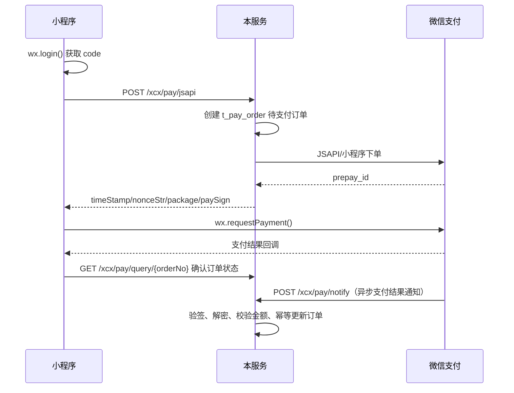

# 微信小程序支付接入文档

本文档说明本项目中微信小程序支付（微信支付 APIv3、JSAPI/小程序支付）的实现方式、接口定义、前端接入步骤和注意事项。

## 1. 参考文档

实现时以微信支付官方文档为准：

- [小程序支付开发指引](https://pay.weixin.qq.com/doc/v3/merchant/4012791911)
- [JSAPI/小程序下单接口](https://pay.wechatpay.cn/doc/v3/merchant/4012791856)
- [支付通知（验签、解密、应答规则）](https://pay.wechatpay.cn/doc/v3/partner/4012886152)
- [支付回调和查单实现指引](https://pay.weixin.qq.com/doc/v3/partner/4012082568)
- [小程序 wx.requestPayment](https://developers.weixin.qq.com/miniprogram/dev/api/payment/wx.requestPayment.html)
- [wechatpay-java 官方 SDK](https://github.com/wechatpay-apiv3/wechatpay-java)

## 2. 业务流程



## 3. 实现文件

| 文件 | 说明 |
| --- | --- |
| `ruoyi-modules/ruoyi-business/src/main/java/com/business/domain/PayOrder.java` | 支付订单实体 |
| `ruoyi-modules/ruoyi-business/src/main/java/com/business/mapper/PayOrderMapper.java` | 支付订单 Mapper |
| `ruoyi-modules/ruoyi-business/src/main/java/com/business/service/IPayOrderService.java` | 支付订单服务接口 |
| `ruoyi-modules/ruoyi-business/src/main/java/com/business/service/impl/PayOrderServiceImpl.java` | 支付订单服务实现 |
| `ruoyi-modules/ruoyi-xcx/src/main/java/com/companion/xcx/config/WechatPayConfig.java` | 微信支付 APIv3 配置初始化 |
| `ruoyi-modules/ruoyi-xcx/src/main/java/com/companion/xcx/service/impl/XcxPayServiceImpl.java` | 下单、回调、查单、关单核心逻辑 |
| `ruoyi-modules/ruoyi-xcx/src/main/java/com/companion/xcx/controller/XcxPayController.java` | 小程序支付接口 |
| `script/sql/ry_xcx_pay.sql` | 支付订单表结构 |

## 4. 前置条件

1. 已申请微信支付商户号，并将小程序 `AppID` 与商户号绑定。
2. 已配置商户 API 证书和证书序列号，并设置 APIv3 密钥。
3. 小程序端已开通微信支付权限。
4. `notifyUrl` 必须是公网可访问的 HTTPS 地址，不能携带查询参数。
5. 执行 `script/sql/ry_xcx_pay.sql` 创建 `t_pay_order` 表。

## 5. 配置示例

`ruoyi-modules/ruoyi-xcx/src/main/resources/application-dev.yml`：

```yaml
wechat:
  miniapp:
    configs:
      wx8ad0e520bfbd2840: your-miniapp-secret
  pay:
    merchantId: your-merchant-id
    merchantSerialNumber: your-cert-serial-number
    apiV3Key: your-api-v3-key
    appid: wx8ad0e520bfbd2840
    privateKeyPath: 1747424896_20260628_cert/apiclient_key.pem
    notifyUrl: https://your-domain.com/xcx/pay/notify
```

## 6. 接口说明

### POST /xcx/auth/login

小程序一键登录。`xcxCode` 使用手机号快速验证组件（`getPhoneNumber`）回调返回的 code；`wxCode` 为 `wx.login()` 返回的 code，选填，传入后后端会换取 openid 并绑定到当前用户，后续下单可不再传 code。

```text
xcxCode: getPhoneNumber 回调的 code（必填）
wxCode:  wx.login() 返回的 code（选填，用于绑定 openid）
```

需要先执行 `script/sql/update/update_xcx_pay_openid.sql` 为用户表增加 `openid` 字段。

### POST /xcx/pay/jsapi

创建支付订单并返回调起支付参数。需要登录态。

请求体：

```json
{
  "orderNo": "GC20260805123000001",
  "code": "wx.login() 返回的 code",
  "description": "游戏陪玩服务",
  "amount": 100,
  "bizType": "companion",
  "bizId": 10001,
  "attach": "order-10001",
  "expireMinutes": 15
}
```

字段说明：

| 字段 | 必填 | 说明 |
| --- | --- | --- |
| `orderNo` | 否 | 商户订单号，6-32 位，只允许数字、大小写字母、`_`、`-`、`|`、`*`；为空时后端自动生成 |
| `code` | 否 | 小程序 `wx.login()` 返回的 code；用户登录时已绑定 openid 则可不传，后端优先使用请求里的 code 换取 openid |
| `description` | 是 | 商品描述，不超过 127 个字符 |
| `amount` | 是 | 支付金额，单位：分 |
| `bizType` | 否 | 业务类型 |
| `bizId` | 否 | 业务 ID |
| `attach` | 否 | 商户附加数据，回调原样返回，不超过 128 个字符 |
| `expireMinutes` | 否 | 支付有效期，默认 15 分钟，最大不超过 15 天 |

成功响应：

```json
{
  "code": 200,
  "msg": "操作成功",
  "data": {
    "orderNo": "GC20260805123000001",
    "appId": "wx8ad0e520bfbd2840",
    "timeStamp": "1754382600",
    "nonceStr": "xxxxxxxxxxxxxxxxxxxxxxxxxxxxxxxx",
    "package": "prepay_id=wx123456789",
    "signType": "RSA",
    "paySign": "xxxxxxxx"
  }
}
```

### GET /xcx/pay/query/{orderNo}

查询当前用户订单。若本地订单仍为待支付，会调用微信查单接口同步状态后返回。

```json
{
  "code": 200,
  "msg": "操作成功",
  "data": {
    "id": 1,
    "orderNo": "GC20260805123000001",
    "status": "1",
    "transactionId": "420000123456789",
    "payTime": "2026-08-05 12:31:00"
  }
}
```

### POST /xcx/pay/close/{orderNo}

关闭未支付订单。已支付订单不能关闭；关闭前会先查询微信订单状态，避免误关。

### GET /xcx/pay/list

获取当前登录用户的支付订单列表。

### POST /xcx/pay/notify

微信支付异步回调接口，已加入安全白名单，不需要登录。处理流程：

1. 使用 `Wechatpay-Serial`、`Wechatpay-Timestamp`、`Wechatpay-Nonce`、`Wechatpay-Signature` 验签。
2. 使用 APIv3 密钥解密 `resource`，得到交易对象。
3. 校验 `event_type` 为 `TRANSACTION.SUCCESS`，`trade_state` 为 `SUCCESS`。
4. 校验本地订单金额与微信回调金额一致。
5. 幂等更新订单状态为已支付。

验签失败或业务校验失败时返回非 2xx，微信支付会按官方策略重试。

## 7. 小程序端示例

```javascript
// 手机号快捷登录：e.detail.code 来自 getPhoneNumber 按钮回调
const loginRes = await wx.login();
const token = await wx.request({
  url: 'https://your-domain.com/xcx/auth/login',
  method: 'POST',
  data: {
    xcxCode: e.detail.code,
    wxCode: loginRes.code
  }
});

const createRes = await wx.request({
  url: 'https://your-domain.com/xcx/pay/jsapi',
  method: 'POST',
  header: {
    Authorization: 'Bearer ' + token
  },
  data: {
    orderNo: 'GC20260805123000001',
    // 登录时已绑定 openid，这里可以不再传 code；如传入则必须是下单前新获取的 wx.login() code
    description: '游戏陪玩服务',
    amount: 100,
    bizType: 'companion',
    bizId: 10001
  }
});

const pay = createRes.data.data;
wx.requestPayment({
  timeStamp: pay.timeStamp,
  nonceStr: pay.nonceStr,
  package: pay.package,
  signType: pay.signType,
  paySign: pay.paySign,
  success() {
    // 支付成功回调不能作为最终依据，需要调后端查单
    wx.request({
      url: 'https://your-domain.com/xcx/pay/query/' + pay.orderNo,
      header: { Authorization: 'Bearer ' + token }
    });
  },
  fail(res) {
    // 用户取消或支付失败，订单保持待支付
    console.error(res.errMsg);
  }
});
```

## 8. 安全与对账建议

1. 下单接口必须校验登录态，openid 由后端在登录时通过 `wx.login` code 换取并保存，不要信任前端传参。
2. 回调必须验签、解密并校验金额，防止“假通知”。
3. 回调要做幂等处理，微信可能重复推送，重复通知直接返回成功。
4. 小程序端 `wx.requestPayment` 的 `success` 回调不代表最终结果，应调用 `/xcx/pay/query/{orderNo}` 确认。
5. 用户再次支付时应使用原商户订单号，避免重复支付。
6. 订单超过支付有效期后应调用 `/xcx/pay/close/{orderNo}` 关单。
7. 建议按官方指引做 T+1 对账，以微信账单和查单接口为准。

## 9. 订单状态

| 状态 | 含义 |
| --- | --- |
| `0` | 待支付 |
| `1` | 已支付 |
| `2` | 已关闭 |
| `3` | 已退款 |

`0` 为可支付状态；`1`、`2`、`3` 为终态。退款能力可在后续业务中基于微信退款 API 扩展。

## 10. 常见问题

### 下单返回 APPID_MCHID_NOT_MATCH

检查小程序 AppID 是否与商户号绑定，以及 `wechat.pay.appid` 是否配置正确。

### 回调收不到

确认 `notifyUrl` 为公网 HTTPS，服务已启动，且回调地址在安全白名单中。

### 返回“支付服务未初始化”

检查商户号、证书序列号、APIv3 密钥、私钥文件路径是否正确，并查看启动日志中 `Wechat Pay config init failed` 的具体原因。
